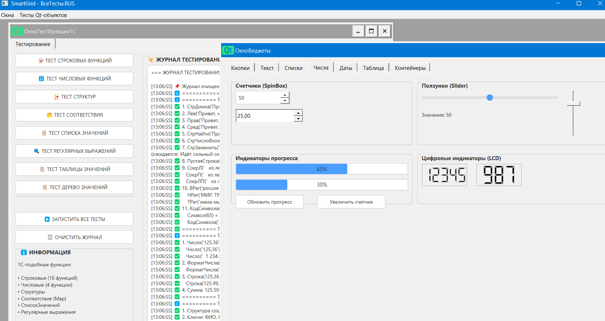

# RusFoxQt6

**Русскоязычный язык сценариев для автоматизации на базе Qt6**

RusFoxQt6 — это русскоязычный 1С-подобный язык программирования для создания сценариев автоматизации, написанный на C++ с использованием библиотеки Qt6. Это расширение и руссификация интерпретатора JavaScript (QJSEngine), встроенного в библиотеку Qt6. Не знаете, как написать код на русском, можете писать на JavaScript. В итоге препроцессор всё равно для исполнения создаёт файл code_after_preprocessor.js на JavaScript, который следует запускаться с директивой отключения препроцессора #NoPreprocess.  Когда сценарий окончательно будет отлажен, то переименуйте окончательный code_after_preprocessor.js в нужное имя и запуск сценария без обработки препроцессором будет быстрее.

Язык позволяет быстро создавать скрипты для работы с файлами, базами данных, сетевыми запросами, графикой, печатью и многим другим. Мой предыдущий проект RusFox (руссификация и расширение FoxPro9) считаю уже устаревшим и не планирую развивать дальше, так как FoxPro9 является 32-ух разрядным. 
Нейросистемы успешно пишут сценарии для RusFoxQt6. Достаточно показать им образцы сценариев, тесты классов и руководство к программе. Руссификация сценариев делает код понятным, а потому позволяет легко поправить код после нейросистемы. Например, интерфейс программы часто проще поправить самому после размещения виджетов в окне нейросистемой, чем объяснять нейросистеме, куда передвинуть и как оформить кнопку. 

Для ИИ-агентов (я использую Hermes) сделан удобные логи для анализа результата выполнения сценария. У каждого объекта можно включить вывод подробных логов, в которых отражаются результаты работы каждого метода класса, а после полной отладки отключить вывод подробных логов. Так же все сообщения в консоль и логи можно выводить в файл, если в текущем каталоге создадите файл с именем Debug.txt. Если такого файла нет, то вывод логов и сообщений будет производиться только в консоль. Анализ записей в таком файле облегчит работу ИИ-агента по созданию и отладке сценария. Но сообщите агенту, чтоб он перед запуском сценария очищал содержимое этого в файла, иначе все сообщения будут только добавляться в файл. 

Процесс создания сценариев совместно с бесплатным DeepSeek я выполняю так:
Если я пишу большое многооконное большое приложение, то я даю задание ИИ-агенту писать его по частям по одному окну с функционалом. Я создаю тестовый сценарий с одним окном в многооконном приложении и предлагаю ИИ-агенту создать в нём нужные виджеты и нужный функционал. Затем оцениваю результат и переношу его в основное моногоокнное приложение.
ИИ-агент после запуска сценария со своим кодом анализирует содержимое файлов Debug.txt и code_after_preprocessor.js и исправляет возникшие ошибки пока в итоге не создаст нужный работающий функционал.

Саму программу RusFoxQt6 v3.0 от 16.08.2026 г. можно взять здесь [https://transfiles.ru/22exq](https://transfiles.ru/22exq) (ссылка действует до 30 августа 2026)

Удобный редактор для написания сценариев можно взять здесь  http://perfolenta.net/

---

## 📋 Содержание

- Особенности языка   
    
- Быстрый старт
- Работа с файлами
- Работа с базами данных 
- HTTP запросы
- Работа с XML и JSON
- Графика и рисование
- Печать документов
- Сетевые сокеты
- Работа с текстом
- Многопоточность
- Системные функции
- Примеры сценариев
- Сравнение с другими языками

---

## ✨ Особенности языка

Этапы работы препроцессора:
1) Проверяется наличие директив в сценарии и правильность их написания. Доступные директивы: "#ОтладкаПрепроцессора", "#PreprocessDebug", "#БезПрепроцессора", "#NoPreprocess". Обработанные директивы удаляются из текста сценария.
2) Составление списка объектов в сценарии: анализируются все строки с сочетанием " = new ", " = Новый ", " = НовыйОбъект(" и составляется список переменных и их типов. При наличие в сценарии оператора #ОтладкаПрепроцессора в консоли для контроля выводится список найденных объектов и имён указателей на каждый объект. 
3) Проверяет доступность объекта в программе: существует ли объект с таким именем. Если объекта таким русским или англоязычным именем не существует то обработка прекращается и в консоль выводится сообщение об ошибке, что таких объектов нет, а потому не могут быть созданы.
4) Препроцессор создает ограничение: нельзя использовать имена указателей на разные объекты с одинаковыми именами даже для однотипных объектов. Препроцессор предупредит, если такие дубли имен указателей на объект будут присутствовать в сценарии. Это обусловлено тем, что далее у каждого создаваемого объекта препроцессор проверяет корректность имен методов, а так же далее переводит русские наименования методов в их англоязычный аналог. Из-за ограничений в компиляции программы на С++ системой MOC нельзя создавать в объектах C++ имена методов с наименованием на кириллице, потому приходится обеспечить переименование методов с русского имени на соответствующее англоязычное наименование.
5) По каждой переменной указателя на объект загружаются списки всех имен методов данного типа объекта и соответствие русских и английских имен методов.
6) По каждой переменной объекта анализируются строки типа "ПеремОбъекта.ИмяМетода("  . Извлекается имя метода между подстроками "ПеремОбъекта." и "("  Если есть соответствующий русский метод в данном классе, то он заменяется на соответствующий английский метод. Если в списке методов данного класса нет такого метода, то заносится информация в список ошибок, что такого метода нет у указанного класса .  
7) Таким образом, проверяется каждый класс, используемый в сценарии. Если имеются ошибки по вызову несуществующего метода, то обработка прекращается и в консоль выводится список существующих методов по данному классу. 
8) Запись типа "= Новый " заменяется на "= new ", а русскоязычные имена классов заменяются на англоязычные аналоги.
9) Русскоязычные имена классов заменяются на англоязычные имена.
10) Удаляются комментарии в конце строк.
11) Производится проверка баланса открывающих и закрывающих фигурных скобок в каждой функции.
12) Создается файл для запуска на JavaScript с установленно1 директивой "#БезПрепроцессора". После отладки сценария следует запускать данный готовый обработанный препроцессором сценарий. 

Начиная с версии 3.0 нельзя писать так виджет3 = НовыйОбъект("QtВиджет"), а следует только так виджет3 = Новый QtВиджет() или виджет3 = new QtВиджет()
### Русскоязычный синтаксис

javascript

   `Сообщить("Привет, мир!")`
   `имя = "Иван"`
   `Если имя == "Иван" Тогда`
    `Сообщить("Привет, Иван!")`
   `Иначе`
        `Сообщить("Кто вы?")`
   `КонецЕсли;`
   `Для i = 1 По 10 Цикл`
          `Сообщить("Итерация " + i)`
   `КонецЦикла;`

### Автоматическая русификация

Все методы и классы имеют русские имена, созданные автоматически из английских аналогов Qt6. Например:

|Английское имя|Русское имя|
|---|---|
|`QFile`|`Файл`|
|`QSqlDatabase`|`БазаДанных`|
|`QTcpSocket`|`TcpСокет`|
|`QPainter`|`Художник`|
|`QJsonDocument`|`JsonДокумент`|

---

## 🚀 Быстрый старт

### Установка

batch

SmartGrid.exe script.js

### Первый сценарий

javascript

    // Создание файла
    файл = Новый Файл("test.txt")
    Если файл.Открыть(файл.ТолькоЗапись) Тогда
        файл.ЗаписатьСтроку("Привет, мир!")
        файл.Закрыть()
        Сообщить("Файл создан!")
    КонецЕсли;

---

## 📁 Работа с файлами

### Основные классы для работы с файловой системой

|Класс|Описание|
|---|---|
|`Файл`|Работа с файлами (чтение/запись)|
|`Каталог`|Работа с каталогами|
|`ИнформацияОФайле`|Получение информации о файле|
|`ВременныйФайл`|Создание временных файлов|
|`ФайлБезопасный`|Безопасная запись файлов|

### Пример: чтение и запись файла

javascript

    // Запись файла
    файл = Новый Файл("data.txt")
    Если файл.Открыть(файл.ТолькоЗапись) Тогда
        файл.ЗаписатьСтроку("Строка 1")
        файл.ЗаписатьСтроку("Строка 2")
        файл.Записать("Без перевода строки")
        файл.Закрыть()
    КонецЕсли;
    
    // Чтение файла
    файл2 = Новый Файл("data.txt")
    Если файл2.Открыть(файл2.ТолькоЧтение) Тогда
        Пока Не файл2.ВКонце() Цикл
            строка = файл2.ПрочитатьСтроку()
            Сообщить(строка)
        КонецЦикла;
        файл2.Закрыть()
    КонецЕсли;

### Пример: работа с каталогами

javascript
    каталог = Новый Каталог("C:/Temp")
    
    Если Не каталог.Существует() Тогда
        каталог.СоздатьПуть("C:/Temp")
    КонецЕсли;
    
    файлы = каталог.СписокФайлов()
    Для каждого файл в файлы Цикл
        Сообщить("Найден: " + файл)
    КонецЦикла;

---

## 🗄️ Работа с базами данных

### Поддерживаемые СУБД

| Драйвер | Русское имя  | Описание               |
| ------- | ------------ | ---------------------- |
| QSQLITE | `SQLite`     | SQLite (встроенная БД) |
| QMYSQL  | `MySQL`      | MySQL / MariaDB        |
| QPSQL   | `PostgreSQL` | PostgreSQL             |
| QODBC   | `ODBC`       | ODBC-совместимые БД    |
| QOCI    | `Oracle`     | Oracle Database        |

### Пример: работа с SQLite

javascript
    база = Новый БазаДанных(база.SQLite())
    база.УстановитьИмяБазыДанных("mydb.db")
    
    Если база.Открыть() Тогда
        // Создание таблицы
        база.ВыполнитьЗапрос("CREATE TABLE IF NOT EXISTS users (id INTEGER PRIMARY KEY, name TEXT, age INTEGER)")
        
        // Вставка данных (транзакция)
        база.НачатьТранзакцию()
        база.ВыполнитьЗапрос("INSERT INTO users (name, age) VALUES ('Иван', 25)")
        база.ВыполнитьЗапрос("INSERT INTO users (name, age) VALUES ('Мария', 30)")
        база.ПодтвердитьТранзакцию()
        
        // Чтение данных
        запрос = база.ВыполнитьЗапрос("SELECT * FROM users")
        Пока запрос.Следующий() Цикл
            имя = запрос.ЗначениеПоИмени("name")
            возраст = запрос.ЗначениеПоИмени("age")
            Сообщить(имя + " - " + возраст + " лет")
        КонецЦикла;
        
        база.Закрыть()
    КонецЕсли;

### Пример: подготовленные запросы

javascript

    база = Новый БазаДанных(база.SQLite())
    база.УстановитьИмяБазыДанных("users.db")
    база.Открыть()
    
    запрос = база.ПодготовитьЗапрос("INSERT INTO users (name, age) VALUES (?, ?)")
    
    пользователи = [{"name": "Анна", "age": 28}, {"name": "Петр", "age": 32}]
    
    Для каждого пользователь in пользователи Цикл
        запрос.СвязатьЗначениеПоИндексу(0, пользователь.name)
        запрос.СвязатьЗначениеПоИндексу(1, пользователь.age)
        запрос.Выполнить()
    КонецЦикла;
    
    база.Закрыть()

---

## 🌐 HTTP запросы

### Основные методы

| Русское имя         | Английское имя    | Описание         |
| ------------------- | ----------------- | ---------------- |
| `Получить`          | `getValue()`      | GET запрос       |
| `ОтправитьPost`     | `postValue()`     | POST запрос      |
| `ОтправитьPostJson` | `postJsonValue()` | POST с JSON      |
| `УстановитьПрокси`  | `setProxyValue()` | Настройка прокси |

### Пример: REST API запрос

javascript

    http = Новый СетевойМенеджер()
    
    http.ПриЗавершении( Функция(успех, данные, код) {
        Если успех Тогда
            Сообщить("Код: " + код)
            Сообщить("Ответ: " + данные)
        Иначе
            Сообщить("Ошибка: " + http.ОшибкаСтрокой())
        КонецЕсли;
    })
    
    // GET запрос
    http.Получить("https://api.github.com/users")
    
    // POST с JSON
    json = {"name": "Новый пользователь", "email": "user@example.com"}
    http.ОтправитьPostJson("https://api.example.com/users", json)

### Пример: заголовки и аутентификация

javascript

    http = Новый СетевойМенеджер()
    
    заголовки = {
        "Authorization": "Bearer token123",
        "Accept": "application/json"
    }
    
    http.ПолучитьСЗаголовками("https://api.example.com/profile", заголовки)
    
    // Через прокси
    http.УстановитьПрокси("proxy.example.com", 8080)

---

## 📄 Работа с XML и JSON

### XML (DOM модель)

javascript

    // Парсинг XML
    док = Новый DomДокумент()
    док.УстановитьСодержимое("<?xml version='1.0'?><book><title>Qt Book</title></book>")
    
    корень = док.КорневойЭлемент()
    название = корень.ПервыйДочернийЭлемент("title").Текст()
    Сообщить("Название: " + название)
    
    // Создание XML
    новыйДок = Новый DomДокумент()
    корень2 = новыйДок.СоздатьЭлемент("catalog")
    новыйДок.УстановитьКорневойЭлемент(корень2)
    
    Для i = 1 По 3 Цикл
        элемент = новыйДок.СоздатьЭлемент("item")
        элемент.УстановитьАтрибут("id", "I" + i)
        элемент.ДобавитьДочерний(новыйДок.СоздатьТекст("Товар " + i))
        корень2.ДобавитьДочерний(элемент)
    КонецЦикла;
    
    Сообщить(новыйДок.ВСтроку(2))

### JSON

javascript

    // Парсинг JSON
    док = Новый JsonДокумент('{"name": "Иван", "age": 30, "hobbies": ["чтение", "спорт"]}')
    
    имя = док.ПолучитьСтроку("name")
    возраст = док.ПолучитьЧисло("age")
    
    Сообщить("Имя: " + имя + ", Возраст: " + возраст)
    
    // Создание JSON
    новыйДок = Новый JsonДокумент()
    объект = новыйДок.СоздатьОбъект()
    объект["name"] = "Мария"
    объект["age"] = 25
    объект["active"] = Истина
    
    массив = новыйДок.СоздатьМассив()
    массив.append("admin")
    массив.append("user")
    объект["roles"] = массив
    
    новыйДок.УстановитьОбъект(объект)
    
    // Сохранение в файл
    новыйДок.СохранитьВФайл("user.json", новыйДок.СОтступами())

---

## 🎨 Графика и рисование

### Графические примитивы

javascript

    // Создание графической сцены
    сцена = Новый ГрафикаСцена(0, 0, 800, 600)
    вид = Новый ГрафикаВид(сцена)
    
    // Рисование фигур
    прямоугольник = Новый_ГрафикаПрямоугольник(100, 100, 200, 150)
    прямоугольник.УстановитьЦветКисти(Qt.blue)
    прямоугольник.УстановитьЦветПера(Qt.black, 2)
    сцена.ДобавитьЭлемент(прямоугольник)
    
    эллипс = Новый_ГрафикаЭллипс(400, 100, 150, 150)
    эллипс.УстановитьЦветКисти(Qt.red)
    сцена.ДобавитьЭлемент(эллипс)
    
    текст = Новый_ГрафикаТекст("Hello, Qt!")
    текст.УстановитьПозицию(100, 400)
    текст.УстановитьШрифт(QFont("Arial", 16))
    сцена.ДобавитьЭлемент(текст)
    
    вид.Показать()

### Рисование через QPainter

javascript

    изображение = Новый Изображение(800, 600, изображение.ARGB32())
    изображение.ЗалитьЦветом(Qt.white)
    
    художник = Новый Художник(изображение)
    художник.УстановитьСглаживание(Истина)
    
    // Рисование линий и фигур
    художник.УстановитьЦветПера(Qt.blue)
    художник.УстановитьТолщинуПера(3)
    художник.НарисоватьЛинию(100, 100, 700, 100)
    
    художник.УстановитьЦветКисти(Qt.yellow)
    художник.НарисоватьПрямоугольник(100, 150, 200, 100)
    
    художник.УстановитьШрифт(QFont("Arial", 14))
    художник.НарисоватьТекст(100, 300, "Рисование текста")
    
    художник.Завершить()
    изображение.Сохранить("output.png")

---

## 🖨️ Печать документов

javascript

    // Печать в PDF
    принтер = Новый Принтер()
    принтер.УстановитьФорматВывода(принтер.PDFФормат)
    принтер.УстановитьИмяВыходногоФайла("document.pdf")
    принтер.УстановитьРазмерСтраницыПоИд(принтер.A4)
    
    художник = Новый Художник(принтер)
    художник.УстановитьШрифт(QFont("Arial", 12))
    художник.НарисоватьТекст(100, 100, "PDF документ создан!")
    художник.Завершить()
    
    // Предпросмотр печати
    предпросмотр = Новый ПредпросмотрПечати(принтер)
    предпросмотр.УстановитьКолбэкРисования(function(printerPtr) {
        художник = Новый Художник(printerPtr)
        художник.НарисоватьТекст(100, 100, "Содержимое страницы")
        художник.Завершить()
    })
    
    результат = предпросмотр.Выполнить()
    Если результат == предпросмотр.Принято() Тогда
        Сообщить("Печать подтверждена")
    КонецЕсли;

---

## 🌐 Сетевые сокеты

### TCP клиент

javascript

    сокет = Новый TcpСокет()
    
    сокет.ПриПодключении( Функция() {
        Сообщить("Подключено к серверу!")
        сокет.ЗаписатьСтроку("Hello, Server!")
    })
    
    сокет.ПриГотовностиЧтения( Функция() {
        данные = сокет.ПрочитатьВсе()
        Сообщить("Получено: " + данные)
        сокет.ОтключитьсяОтХоста()
    })
    
    сокет.ПриОшибке( Функция(код, сообщение) {
        Сообщить("Ошибка: " + сообщение)
    })
    
    сокет.ПодключитьсяКХосту("example.com", 80)

### UDP сокет

javascript

    сокет = Новый UdpСокет()
    сокет.ПривязатьКПорту(8888)
    
    сокет.ПриГотовностиЧтения(function() {
        Пока сокет.ЕстьДатаграммы() Цикл
            данные = ""
            хост = ""
            порт = 0
            сокет.ПрочитатьДатаграмму(данные, хост, порт)
            Сообщить("Получено от " + хост + ":" + порт + " -> " + данные)
        КонецЦикла;
    })
    
    // Отправка
    сокет.ОтправитьНаАдрес("Привет!", "localhost", 8888)

---

## 📝 Работа с текстом

### Строковые операции (1С-подобные)

javascript

    стр = "Программирование на языке RusFoxQt6"
    
    Сообщить("Длина: " + СтрДлина(стр))
    Сообщить("Лев(10): " + Лев(стр, 10))
    Сообщить("Прав(10): " + Прав(стр, 10))
    Сообщить("Сред(5, 10): " + Сред(стр, 5, 10))
    
    // Поиск и замена
    Если СтрНайти(стр, "RusFox") > 0 Тогда
        Сообщить("Найдено!")
    КонецЕсли;
    
    новая = СтрЗаменить(стр, "RusFox", "RusFoxQt6")
    Сообщить(новая)
    
    // Регистр
    Сообщить(ВРег(стр))   // ВЕРХНИЙ РЕГИСТР
    Сообщить(НРег(стр))   // нижний регистр
    Сообщить(ТРег(стр))   // Титульный Регистр
    
    // Работа с датами
    текущая = ТекущаяДата()
    Сообщить("Год: " + Год(текущая))
    Сообщить("Месяц: " + Месяц(текущая))
    Сообщить("День: " + День(текущая))

### Текстовый документ с форматированием

javascript

    док = Новый ТекстовыйДокумент()
    
    // Установка содержимого
    док.УстановитьHtml("<h1>Заголовок</h1>
<b>Жирный текст</b>
")
    
    // Поиск и замена
    Если док.Найти("Заголовок", 0, 0) Тогда
        док.ЗаменитьВсе("Заголовок", "Новый заголовок")
    КонецЕсли;
    
    // Печать документа
    док.ПечатьВPdf("document.pdf")

---

## ⚡ Многопоточность

### Потоки и задачи

javascript

    // Создание потока
    поток = Новый Поток()
    поток.ЗапуститьСФункцией( Функция() {
        Для i = 1 По 5 Цикл
            Сообщить("Поток: итерация " + i)
            Поток.СпатьМс(1000)
        КонецЦикла;
    })
    
    // Пул потоков
    пул = Новый ПотокПул()
    пул.УстановитьМаксимумПотоков(4)
    
    Для i = 1 По 20 Цикл
        пул.ЗапуститьЗадачу(function() {
            // Длительная операция
            Поток.СпатьМс(100)
        })
    КонецЦикла;
    
    пул.Ожидать()
    Сообщить("Все задачи выполнены")
КОНЕЦПРОЦЕДУРЫ

### Синхронизация

javascript

    мьютекс = Новый Мьютекс()
    счётчик = 0
    
    Функция УвеличитьСчётчик()
        мьютекс.Заблокировать()
        счётчик = счётчик + 1
        мьютекс.Разблокировать()
    КонецФункции
    
    // Запуск потоков
    Для i = 1 По 100 Цикл
        поток = Новый Поток()
        поток.ЗапуститьСФункцией(УвеличитьСчётчик)
    КонецЦикла;

---

## 🛠️ Системные функции

### Консольный ввод/вывод

javascript

    ВывестиВКонсоль("Введите имя: ")
    имя = ПрочитатьСтроку()
    
    ВывестиСтрокуВКонсоль("Привет, " + имя + "!")
    
    возраст = ПрочитатьЧисло("Введите возраст: ")
    Сообщить("Ваш возраст: " + возраст)

### Работа с процессами

javascript

    // Запуск внешней программы
    результат = ВыполнитьКоманду("dir")
    Сообщить(результат)
    
    // Запуск процесса
    Если ЗапуститьПроцесс("notepad.exe") Тогда
        Сообщить("Блокнот запущен")
    КонецЕсли;

### Работа с датой и временем

javascript

    сейчас = ТекущаяДатаВремя()
    Сообщить("Текущая дата: " + сейчас.ВСтроку("dd.MM.yyyy"))
    
    // Арифметика с датами
    завтра = сейчас.ДобавитьДни(1)
    черезМесяц = сейчас.ДобавитьМесяцы(1)
    
    разница = сейчас.ДнейДо(НовыйГод)
    Сообщить("До Нового года: " + разница + " дней")

---

## 📚 Примеры сценариев

### Парсинг веб-страницы

javascript

    http = Новый СетевойМенеджер()
    
    http.ПриЗавершении( Функция(успех, данные, код) {
        Если успех Тогда
            // Парсинг HTML как XML
            док = Новый DomДокумент()
            Если док.УстановитьСодержимое(данные) Тогда
                ссылки = док.ЭлементыПоИмениТега("a")
                Сообщить("Найдено ссылок: " + ссылки.Длина())
                
                Для i = 0 По ссылки.Длина() - 1 Цикл
                    ссылка = ссылки.Элемент(i)
                    href = ссылка.ПолучитьАтрибут("href")
                    Если href Тогда
                        Сообщить("Ссылка: " + href)
                    КонецЕсли;
                КонецЦикла;
            КонецЕсли;
        КонецЕсли;
    })
    
    http.Получить("https://example.com")

### Генератор отчётов

javascript

    // Чтение данных из БД
    база = Новый БазаДанных(база.SQLite())
    база.УстановитьИмяБазыДанных("sales.db")
    база.Открыть()
    
    запрос = база.ВыполнитьЗапрос("SELECT * FROM sales")
    
    // Создание HTML отчёта
    док = Новый ТекстовыйДокумент()
    док.УстановитьHtml("<!DOCTYPE html><html><head></head><body>" +
        "<h1>Отчёт о продажах</h1>")
    
    // Формирование таблицы
    док.ВставитьТекст("<table><th>ID</th><th>Товар</th><th>Кол-во</th><th>Сумма</th></tr>")
    Пока запрос.Следующий() Цикл
        док.ВставитьТекст("<tr><td>" + запрос.Значение(0) + "</td>" +
                          "<td>" + запрос.Значение(1) + "</td>" +
                          "<td>" + запрос.Значение(2) + "</td>" +
                          "<td>" + запрос.Значение(3) + "</td></table>")
    КонецЦикла;
    док.ВставитьТекст("<table></body></html>")
    
    // Сохранение отчёта
    док.ПечатьВPdf("report.pdf")
    Сообщить("Отчёт создан: report.pdf")
    
    база.Закрыть()

### Мониторинг системы

javascript

    // Получение информации о дисках
    диски = Каталог.СписокДисков()
    Для каждого диск в диски Цикл
        информация = Новый ИнформацияОФайле(диск)
        Сообщить(диск + " - " + информация.ТипФайла())
    КонецЦикла;
    
    // Создание временного файла для логов
    лог = Новый ВременныйФайл("log_XXXXXX.txt")
    Если лог.Открыть() Тогда
        лог.ЗаписатьСтроку("Лог мониторинга")
        лог.ЗаписатьСтроку("Дата: " + ТекущаяДата())
        лог.Закрыть()
        Сообщить("Лог создан: " + лог.ИмяФайла())
    КонецЕсли;

---

## 📊 Сравнение с другими языками

|Возможность|RusFoxQt6|1С|Python|JavaScript|
|---|---|---|---|---|
|Русский синтаксис|✅|✅|❌|❌|
|Работа с БД|✅|✅|✅|✅|
|HTTP запросы|✅|✅|✅|✅|
|XML/JSON|✅|✅|✅|✅|
|Графика|✅|❌|✅|❌|
|Печать|✅|✅|❌|❌|
|Многопоточность|✅|❌|✅|✅|
|Сокеты|✅|❌|✅|✅|
|Кроссплатформенность|✅|❌|✅|✅|
|Интеграция с Qt|✅|❌|❌|❌|

---

## 📖 Заключение

RusFoxQt6 — это мощный и гибкий язык для автоматизации, который сочетает в себе:

- **Русскоязычный синтаксис** — понятный и доступный для русскоязычных разработчиков
    
- **Мощь Qt6** — доступ ко всем возможностям библиотеки Qt6
    
- **1С-подобные функции** — знакомый синтаксис для тех, кто работает с 1С
    
- **Кроссплатформенность** — работает на Windows, Linux и macOS
    
- **Производительность** — основан на высокопроизводительном движке JavaScript
    

Язык идеально подходит для:

- Автоматизации рутинных задач
    
- Обработки данных из различных источников
    
- Создания отчётов и документов
    
- Взаимодействия с веб-сервисами
    
- Работы с файловыми системами и базами данных
    

---

## 🔗 Полезные ссылки

- [Документация по Qt6](https://doc.qt.io/qt-6/)
    
- Русскоязычные классы и методы
    

---

_RusFoxQt6 — язык для тех, кто хочет программировать на русском с мощью Qt6_